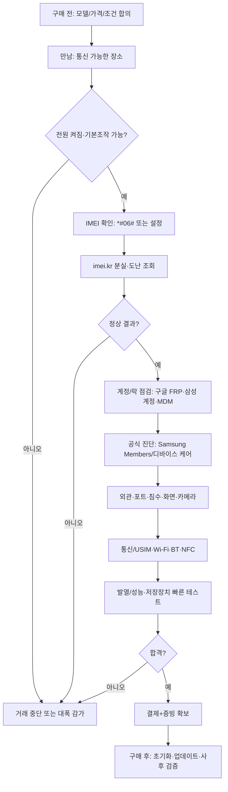
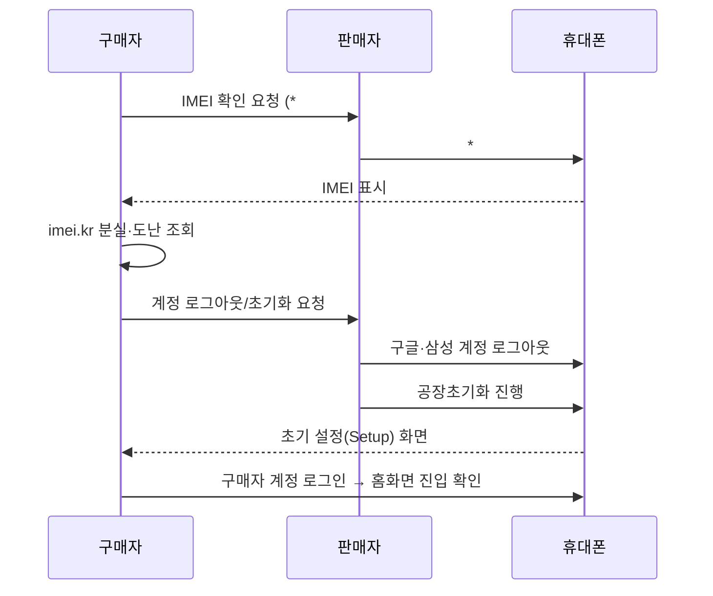

# 갤럭시 중고 구매 체크리스트 (MD)

> 목표: **“사용 불가/법적 리스크”를 먼저 차단**하고, 그 다음에 **기기 상태(화면·통신·배터리·침수 등)**를 검증한다.  
> 핵심 우선순위: **락/법적 → 핵심 기능 → 가치(컨디션/성능)**

---

## 0) 한눈에 보는 핵심 6대 필수 체크(요약)
1. **IMEI 점검(분실·도난폰 조회)**
2. **통신사 정상 해지(확정기변/정상해지) 확인**
3. **구글락(FRP) 등 계정 등록 상태 확인**
4. **루팅 여부 확인(녹스/무결성 훼손 여부)**
5. **최초 통화일 확인(사용 시작 시점 단서)**
6. **`*#0*#` + 삼성 Members 앱 자가진단**  
   - 효율을 위해 **충전기/케이블 + 이어폰 + (가능하면) 본인 유심** 지참

---

## Executive Summary (리스크 축 4가지)
중고 갤럭시 구매에서 큰 손실로 이어지는 리스크는 보통 아래 4축으로 수렴한다.

- **법적·거래 리스크**: 분실·도난 단말, 장물 이슈, 미배송/환불 지연 등  
- **계정·보안 리스크**: 구글 FRP(초기화 보호), 삼성 계정 연동, 조직/MDM 관리 잔존  
- **숨은 하드웨어 리스크**: 침수·부식·수리 이력·배터리 열화 (외관만으로 확인 어려움)  
- **성능·발열·저장장치 리스크**: 스로틀링(열 제한)로 체감 성능 저하, 저장장치 마모/오류

---

## 범위와 전제
- 본 문서는 특정 모델을 지정하지 않은 **갤럭시 전반 공통** 체크리스트다.
- One UI/Android 버전에 따라 **메뉴 경로·표기명**이 달라질 수 있다.
- 모델별 확인 포인트(예: IP 등급, 폴더블 힌지, S펜, microSD/이어폰잭 유무)는 **공통 점검 후** 별도 확인한다.

---

## 준비물(현장 효율 극대화)
- [ ] **충전기(보조배터리) + 케이블**(유선 충전/포트 체크)
- [ ] **이어폰(유선/무선 중 1)**(오디오/통화 테스트)
- [ ] **본인 유심(가능하면)**(통신·문자·데이터 실사용 검증)
- [ ] (선택) 라이트/손전등, 단색 테스트 이미지, NFC 태그(교통카드 등)

---

## 즉시 거래 중단(Stop Conditions)
아래 중 **하나라도 걸리면** 보통은 거래 중단이 안전하다.
- [ ] IMEI 조회 결과가 **분실/도난/이상** 또는 IMEI 불일치
- [ ] 초기화 후 **구글락(FRP)** 화면이 뜨는데 판매자가 현장에서 해결 불가
- [ ] **조직/MDM(직장 프로필)** 흔적이 있고 해제 증빙 불가
- [ ] 화면 결함(심한 번인/줄/터치 불량) 또는 통신 불가(유심 인식/발신 불가)

---

## 단계별 점검 설계(현장 흐름)
> 누락 시 치명적인 순서: **락/법적 → 핵심 기능 → 가치**

---

# 1) 구매 전 체크리스트(판매자 접촉 단계)

## 1-1. 판매자에게 미리 물어볼 질문(템플릿)
- [ ] 모델명/모델번호(SM-XXXXN), 저장용량(128/256/512), 색상
- [ ] 자급제/통신사, **정상해지/확정기변 가능 여부**
- [ ] **수리/침수/배터리 교체 이력**(있으면 영수증/내역)
- [ ] 구성품(박스/충전기/영수증) 유무
- [ ] **IMEI 제공 가능 여부**(현장 확인 전이라도 “가능/불가” 답변 확보)
- [ ] 택배면 **안전결제(에스크로)** 가능 여부 / 직거래면 점검 시간 합의

## 1-2. 거래 구조(증빙) 세팅
- [ ] 대화 내용 캡처(조건/가격/상태 고지)
- [ ] 송금 전 “현장 점검 후 결제” 원칙 합의
- [ ] (택배) 반품/환불 조건 문장으로 합의

---

# 2) 현장 점검 체크리스트(직거래 기준)

## 2-0. 첫 체크(전원·기본조작)
- [ ] 전원 켜짐 / 터치 기본 동작 / 잠금해제 가능
- [ ] 외관 크게 파손(프레임 휨·후면 들뜸) 있으면 즉시 경계

---

## 2-1. IMEI 점검(분실·도난 조회) — **필수**
**방법**
- [ ] 다이얼에서 `*#06#` → IMEI 확인
- [ ] 설정의 IMEI/일련번호와 **교차 일치** 확인
- [ ] IMEI로 **imei.kr 분실·도난 조회** → 결과 캡처 저장

**Fail 시 대응**
- [ ] 분실·도난/불일치/조회 불가면 **즉시 거래 중단**(가장 안전)

---

## 2-2. 통신사 정상 해지 확인 — **필수**
**목표**: “개통/확정기변/사용”에 제약이 없는 상태인지 확인

- [ ] 판매자에게 **정상해지/확정기변 가능** 여부 재확인(문장으로 남기기)
- [ ] (가능하면) 본인 유심 삽입 → **신호 잡힘**
- [ ] 발신/수신 1회 + SMS 1회 + 데이터 로딩 1회

**Fail 시 대응**
- [ ] 유심 인식/통신 불가면 **거래 보류 또는 중단**(원인 판별이 어려움)

---

## 2-3. 계정 등록 상태(구글락/삼성 계정/초기화) — **필수급**
**목표**: 초기화 후에도 “이전 소유자 계정 요구”가 남지 않게 하기

- [ ] 판매자가 **구글 계정/삼성 계정 로그아웃** 직접 수행
- [ ] 가능하면 현장에서 **공장초기화 진행**
- [ ] 초기화 후 설정 마법사에서 **구매자 계정으로 로그인 → 홈화면 진입**까지 확인

**Fail 시 대응**
- [ ] FRP(구글락) 화면이 뜨고 판매자가 즉시 해결 못 하면 **거래 중단**

---

## 2-4. 루팅/무결성(녹스 깨짐) 여부 — **권장(목적 따라 필수)**
**중요한 경우**: 금융/인증/업무(MDM) 사용 예정이면 특히 중요
> 볼륨 업, 볼륨다운 버튼을 누른 상태에서 USB 연결 -> Warning이 나오면 볼륨 업으로 확인

- [ ] (가능하면) Knox/무결성 관련 이상 징후 확인
- [ ] 의심되면 **가격 재협상** 또는 목적상 회피

---

## 2-5. 최초 통화일 확인 — **권장**
**의미**: “실사용 시작 시점”의 단서(배터리/마모 추정 보조)

- [ ] 설정에서 “최초 통화일/사용 시작일” 항목 확인(표기/경로는 기기별 상이)
- [ ] 판매자의 설명(구매 시기/사용 기간)과 상호 일관성 체크

---

## 2-6. `*#0*#` / 삼성 Members 자가 진단 — **필수~권장 경계**
> 시간 대비 커버리지가 좋아서 “현장 효율” 최상

- [ ] `*#0*#` 메뉴(가능한 항목만)로 화면/센서/색상 등 간단 점검
- [ ] **Samsung Members 앱 → 진단(휴대전화 진단)** 실행
  - 배터리/USB/스피커/마이크/센서/네트워크 등 PASS/FAIL 확인
- [ ] FAIL 항목은 아래 개별 테스트로 추가 확인

---

## 2-7. 핵심 기능 빠른 테스트(필수 영역)
### 화면(번인/줄/데드픽셀/색 균일) — **필수**
- [ ] 밝기 80~100%  
- [ ] 흰/검/회/RGB 단색으로 얼룩·줄·번인 확인
- [ ] 터치 전체 영역 지그재그 → 끊김/유령터치 확인

### 카메라(후면/전면, AF/OIS) — **필수**
- [ ] 0.5x/1x/망원 전환(지원 렌즈) + 초점 확인
- [ ] 4K 동영상 짧게 촬영 후 재생(떨림/초점 펌핑/음성)

### 충전/포트(USB-C) — **필수**
- [ ] 유선 충전 인식 + 끊김/유격 확인
- [ ] 포트 내부 부식/이물/핀 손상 의심 시 거래 중단 권장

### 오디오/통화(스피커·마이크) — **필수**
- [ ] 통화 1회(스피커폰 on/off)
- [ ] 음성녹음 10초 → 재생(지직/먹먹함 체크)

---

## 2-8. 추가 권장(시간 여유 있을 때)
- [ ] Wi-Fi / Bluetooth 페어링 / NFC 태그 인식
- [ ] 발열: 카메라+지도 등 부하 → 과열/버벅임 체크
- [ ] 저장공간 총용량/사용량이 판매자 말과 일치하는지 확인
- [ ] 외관: 프레임 휨, 후면 들뜸, 나사/틈새(분해 흔적), 부식/냄새(침수 의심)

---

# 3) 결제/증빙(분쟁 대비용)
- [ ] IMEI 조회 결과 캡처
- [ ] 기기 외관(전면/후면/모서리/포트) 사진
- [ ] “정상해지/락 없음/침수 없음/수리 이력” 등 판매자 고지 내용 캡처
- [ ] 송금 내역/영수증/거래 장소·시간 기록

---

# 4) 구매 후(첫날) 체크리스트
- [ ] 필요 시 공장초기화(조건 충족 상태에서)
- [ ] OS/보안 패치/Google Play 시스템 업데이트 적용
- [ ] 화면잠금(PIN/생체) 설정
- [ ] 삼성 Find / 구글 Find 설정(분실 대비)
- [ ] 장시간 사용 테스트(발열/배터리/카메라/통신 재검증)
- [ ] 문제 발견 시 즉시 증빙 정리 후 환불/분쟁 루트 검토

---

# 퀵 레퍼런스(도구·명령어)
| 목적 | 도구/명령 | 비고 |
|---|---|---|
| IMEI 확인 | `*#06#` | 결과 캡처 |
| 하드웨어 테스트(일부) | `*#0*#` | 기기/버전에 따라 제한 가능 |
| 공식 자가진단 | Samsung Members → 진단 | 현장 효율 최고 |
| (선택, 구매 후) 배터리 덤프 | `adb shell dumpsys battery` | 현장에서는 비추천(시간/보안) |

---

## 레퍼런스 신뢰도 등급(문서화용)
- **A**: 법령/공공기관/제조사(삼성·구글) 공식 문서  
- **B**: 학술/표준/전문기관 보고서  
- **C**: 신뢰 가능한 전문 매체/리뷰  
- **D**: 커뮤니티/블로그(절차 예시로만)

---

## 결론(현장 실무 한 줄)
**“IMEI(분실·도난) + 락(FRP/MDM) + 화면 + 통신” 4종을 통과하면, 나머지는 가격 협상 영역이다.**
